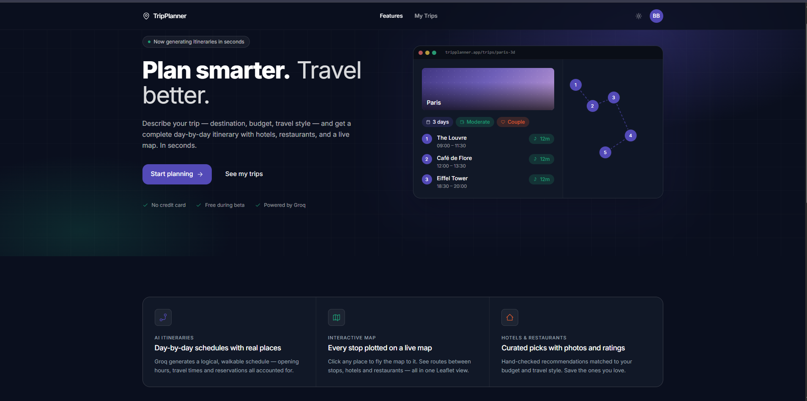
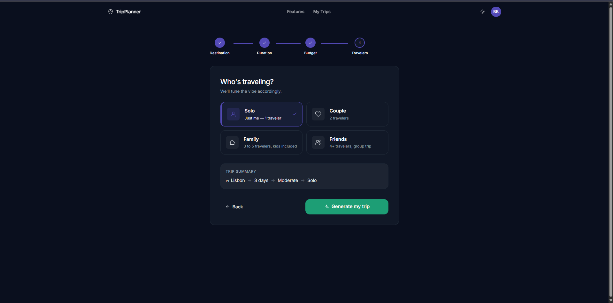
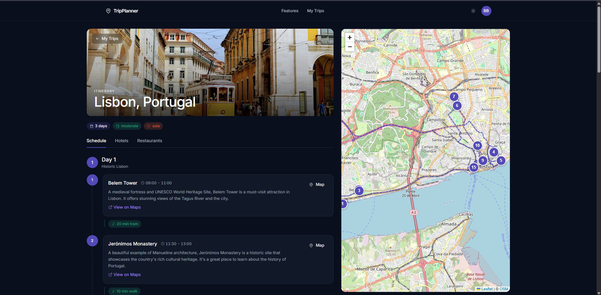
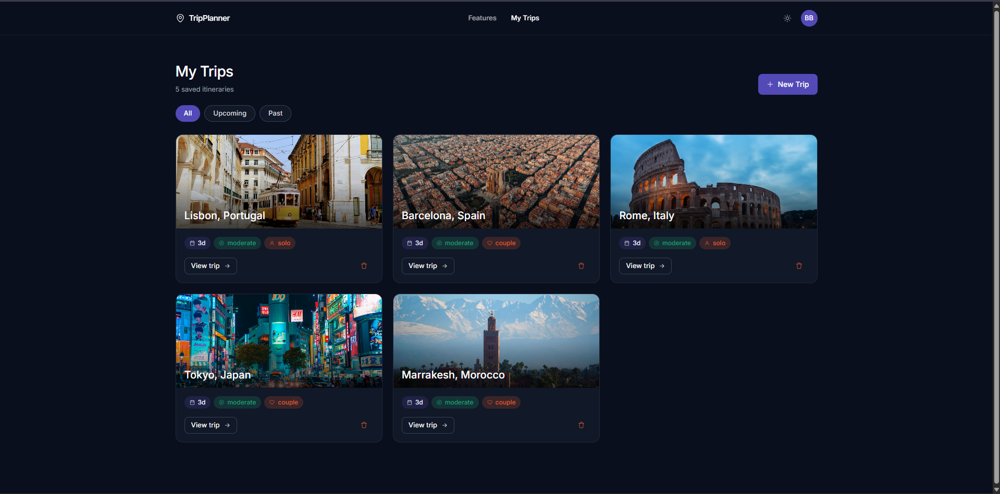

# TripPlanner

> AI-powered travel itinerary generator built with React 18 + Laravel 12.

Pick a destination, set your days, budget, and travel group — the app calls an LLM to build a complete day-by-day schedule with hotels, restaurants, and an interactive map.



---

## Features

- 🤖 **AI-powered itinerary generation** using Groq (llama-3.3-70b-versatile)
- 🗺️ **Interactive map** with real road routing via OSRM + Leaflet
- 🏨 **Hotel & restaurant recommendations** with real photos from Unsplash
- 📅 **Day-by-day schedule** with activities, timings, and travel times
- 💰 **Budget tracker** with category breakdown estimation
- 🌍 **Worldwide city search** powered by Nominatim / OpenStreetMap
- 🌙 **Dark / Light mode** with persistence via localStorage
- 📁 **Upcoming / Past trips filtering** based on start date
- 🔐 **Secure authentication** via Firebase + Laravel Sanctum
- 🖼️ **Unsplash photo caching** in database to optimize API usage

---

## Stack

| Layer | Technology |
|---|---|
| Frontend | React 18 + Vite 5 + Tailwind CSS |
| Backend | Laravel 12 (REST API) |
| Database | MySQL |
| Authentication | Firebase Authentication + Laravel Sanctum |
| AI Generation | Groq API (llama-3.3-70b-versatile) |
| Maps | Leaflet + OpenStreetMap + OSRM |
| Photos | Unsplash API (proxied via Laravel) |
| City Search | Nominatim / OpenStreetMap |

---

## Project Structure

```
TripPlanner/
├── backend/          Laravel 12 API
└── frontend/         React 18 + Vite app
```

---

## Getting Started

### Prerequisites

- PHP 8.2+, Composer
- Node.js 18+, npm
- MySQL (via XAMPP or similar)

### Backend

```bash
cd backend
cp .env.example .env          # fill in DB credentials and API keys
composer install
php artisan key:generate
php artisan migrate
php artisan serve             # runs on http://localhost:8000
```

### Frontend

```bash
cd frontend
cp .env.example .env          # set VITE_API_URL and Firebase config
npm install
npm run dev                   # runs on http://localhost:5173
```

### XAMPP Startup Order

1. Start Apache
2. Start MySQL
3. `php artisan serve` in `/backend`
4. `npm run dev` in `/frontend`

---

## Environment Variables

### Backend (`backend/.env`)

| Variable | Description |
|---|---|
| `DB_DATABASE` | MySQL database name |
| `DB_USERNAME` | MySQL username |
| `DB_PASSWORD` | MySQL password |
| `FIREBASE_PROJECT_ID` | Firebase project ID (for token verification) |
| `GROQ_API_KEY` | Groq API key |
| `UNSPLASH_ACCESS_KEY` | Unsplash API access key |

### Frontend (`frontend/.env`)

| Variable | Description |
|---|---|
| `VITE_API_URL` | Laravel backend URL (e.g. `http://localhost:8000/api`) |
| `VITE_FIREBASE_API_KEY` | Firebase web API key |
| `VITE_FIREBASE_AUTH_DOMAIN` | Firebase auth domain |
| `VITE_FIREBASE_PROJECT_ID` | Firebase project ID |
| `VITE_FIREBASE_STORAGE_BUCKET` | Firebase storage bucket |
| `VITE_FIREBASE_MESSAGING_SENDER_ID` | Firebase messaging sender ID |
| `VITE_FIREBASE_APP_ID` | Firebase app ID |

---

## Database

### `users`

| Column | Type | Notes |
|---|---|---|
| `id` | bigint PK | |
| `name` | string | |
| `email` | string | unique |
| `firebase_uid` | string | unique, nullable |
| `avatar_url` | string | nullable |
| `password` | string | nullable (Firebase users have no password) |
| `email_verified_at` | timestamp | nullable |
| `remember_token` | string | |
| `created_at`, `updated_at` | timestamps | |

### `trips`

| Column | Type | Notes |
|---|---|---|
| `id` | bigint PK | |
| `user_id` | FK → users | cascade delete |
| `destination` | string | e.g. `"Paris, France"` |
| `days` | tinyint unsigned | 1–14 |
| `budget` | enum | `cheap`, `moderate`, `luxury` |
| `travelers` | enum | `solo`, `couple`, `family`, `friends` |
| `start_date` | date | nullable |
| `cover_image` | string | nullable, Unsplash URL |
| `trip_data` | json | full AI-generated itinerary |
| `created_at`, `updated_at` | timestamps | |

---

## Models & Relationships

### `User`
- `hasMany(Trip::class)`
- Traits: `HasApiTokens`, `HasFactory`, `Notifiable`

### `Trip`
- `belongsTo(User::class)`
- `trip_data` cast to array; `start_date` cast to `date:Y-m-d`

---

## API Routes

Base prefix: `/api/v1`

| Method | URI | Controller | Auth | Rate Limit |
|---|---|---|---|---|
| `POST` | `/auth/firebase-login` | `AuthController@firebaseLogin` | — | 5 req/min |
| `GET` | `/proxy/search-images` | `ProxyController@searchImages` | — | — |
| `POST` | `/auth/logout` | `AuthController@logout` | Sanctum | — |
| `GET` | `/auth/me` | `AuthController@me` | Sanctum | — |
| `POST` | `/trips/generate` | `TripController@generate` | Sanctum | 10 req/min |
| `GET` | `/trips` | `TripController@index` | Sanctum | — |
| `POST` | `/trips` | `TripController@store` | Sanctum | — |
| `GET` | `/trips/{trip}` | `TripController@show` | Sanctum | — |
| `PATCH` | `/trips/{trip}/photos` | `TripController@updatePhotos` | Sanctum | — |
| `DELETE` | `/trips/{trip}` | `TripController@destroy` | Sanctum | — |

---

## Frontend Pages & Routes

| Route | Component | Protected |
|---|---|---|
| `/` | `Home` | No |
| `/auth` | `Auth` | No |
| `/create-trip` | `CreateTrip` | Yes |
| `/view-trip/:id` | `ViewTrip` | Yes |
| `/my-trips` | `MyTrips` | Yes |

Protected routes redirect unauthenticated users to `/auth` with a `state.from` redirect-back after login.

### Key Frontend Files

| File | Purpose |
|---|---|
| `src/App.jsx` | Router setup, `ProtectedRoute`, `AuthProvider` wrapper |
| `src/firebase.js` | Firebase app init + auth export |
| `src/context/AuthContext.jsx` | Auth state: `user`, `loading`, `login()`, `logout()` |
| `src/hooks/useAuth.js` | `useContext(AuthContext)` convenience hook |
| `src/services/apiClient.js` | Axios instance with Bearer token interceptor |
| `src/services/authService.js` | Firebase login → Laravel Sanctum token exchange |
| `src/services/unsplash.js` | Photo fetch via backend proxy with in-memory cache |
| `src/components/Header.jsx` | Top nav: logo, theme toggle, auth state |
| `src/components/icons.jsx` | Custom SVG icon components (`currentColor` pattern) |
| `src/components/ui.jsx` | `Button`, `Badge`, `Card`, `cx` utility |

---

## External APIs & Third-Party Services

| Service | Used In | Purpose |
|---|---|---|
| **Firebase Authentication** | Frontend + Backend | User identity via Google/email sign-in. Frontend obtains a Firebase ID token; backend verifies it via `FirebaseTokenVerifier` and issues a Sanctum bearer token. |
| **Groq API** (`api.groq.com`) | `backend/app/Services/GroqService.php` | AI trip generation using `llama-3.3-70b-versatile`. Sends a structured prompt, extracts JSON itinerary from the response. |
| **Unsplash API** (`api.unsplash.com`) | `backend/app/Services/UnsplashService.php` | Photo search for destination covers, hotel cards, and restaurant cards. Proxied through Laravel — the API key never reaches the client. |
| **Nominatim / OpenStreetMap** (`nominatim.openstreetmap.org`) | `frontend/src/pages/CreateTrip.jsx` | City autocomplete in the Destination step. No API key required. |
| **Leaflet + OSM tiles** | `frontend/src/pages/ViewTrip.jsx` | Interactive map with activity pins in the Schedule tab. |
| **OSRM** (`router.project-osrm.org`) | `frontend/src/pages/ViewTrip.jsx` | Real road routing between activities on the interactive map. |

---

## Trip Data Structure (`trip_data` JSON)

The AI returns — and the frontend reads — this shape:

```json
{
  "days": [
    {
      "day": 1,
      "title": "Day theme",
      "activities": [
        {
          "name": "Place name",
          "time": "09:00 - 11:00",
          "description": "Brief description",
          "geo": { "lat": 48.8606, "lng": 2.3376 },
          "travelNext": { "mode": "walk", "mins": 15 }
        }
      ]
    }
  ],
  "hotels": [
    {
      "name": "Hotel name",
      "area": "Neighborhood",
      "rating": 4.5,
      "price": 150,
      "lat": 48.86,
      "lng": 2.34,
      "description": "Brief description",
      "photo_url": null
    }
  ],
  "restaurants": [
    {
      "name": "Restaurant name",
      "cuisine": "French",
      "rating": 4.3,
      "priceRange": "€€",
      "lat": 48.86,
      "lng": 2.34,
      "description": "Brief description",
      "photo_url": null
    }
  ]
}
```

`photo_url` fields start as `null` and are filled in by the frontend after fetching Unsplash images, then persisted via `PATCH /trips/{trip}/photos`.

---

## Running Tests

```bash
cd backend
php artisan test
```

17 feature tests covering auth, trip CRUD, and generation.

---

## Screenshots

| Page | Preview |
|---|---|
| Home |  |
| Create Trip |  |
| Trip Detail |  |
| My Trips |  |

---

## Author

**BELHAMRA Bachar**
Filière : Développement Digital — Option Web Full Stack
Cité des Métiers et des Compétences (CMC) — Rabat-Salé-Kénitra
Encadré par : M. Abdellah BOUSKINE
Année universitaire : 2025/2026

---

## License

MIT License © 2025/2026 BELHAMRA Bachar
